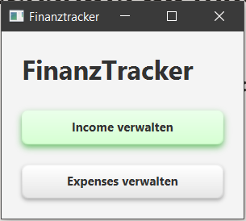
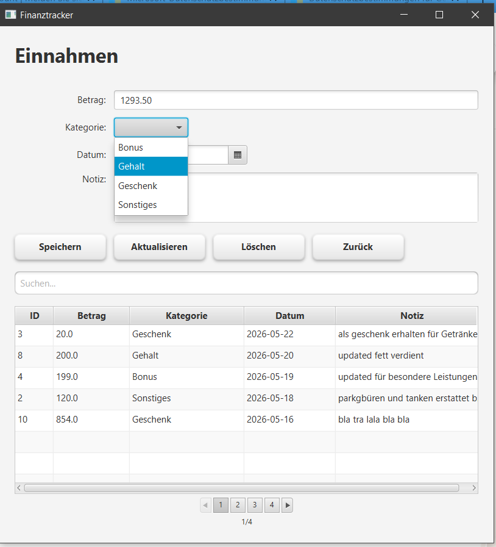
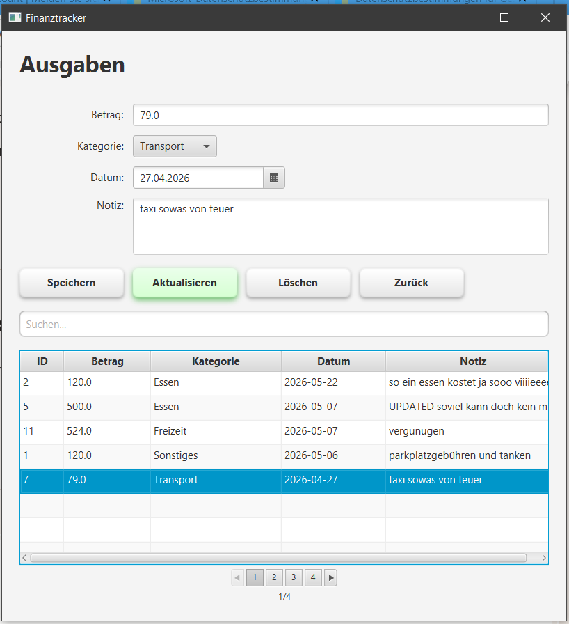
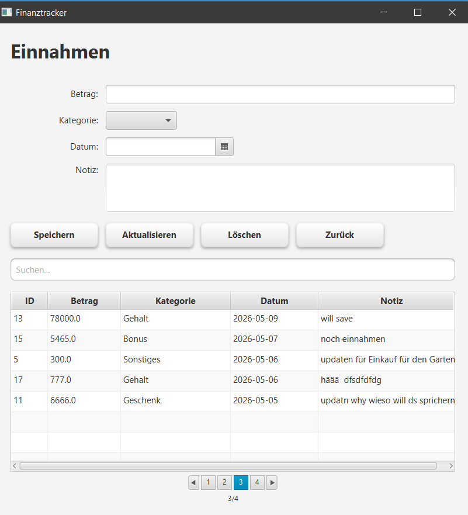
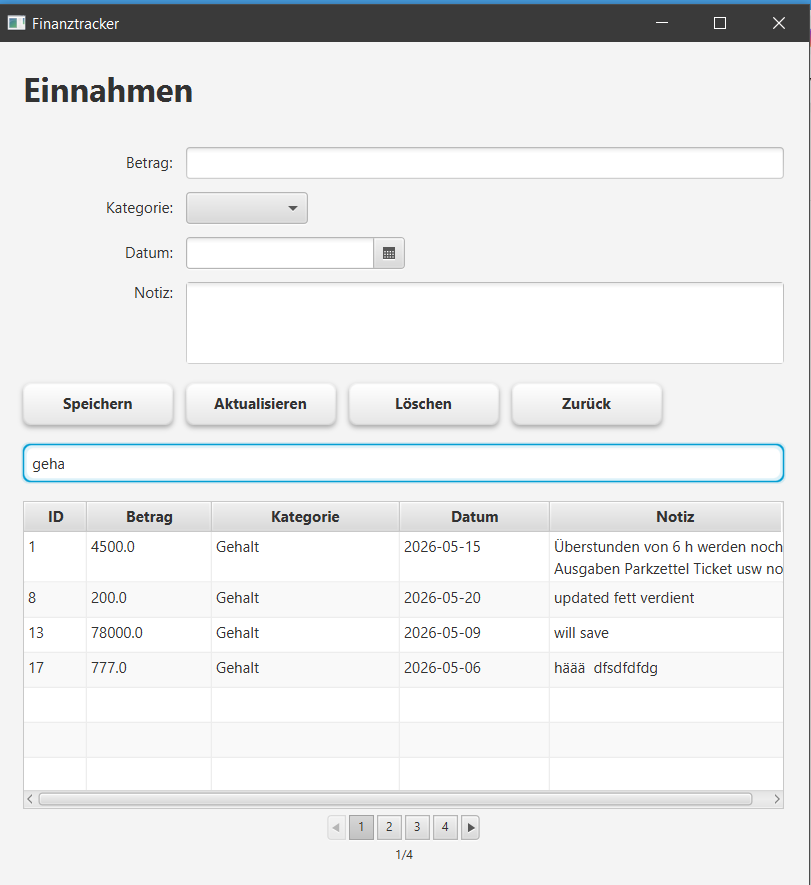

# 💰 FinanzTracker – JavaFX Desktop App

Eine moderne Desktop‑**Buchhaltungs-Software** zur Verwaltung von **Einnahmen** und **Ausgaben**.  
Erstellt mit **Java 17**, **JavaFX 21**, **SQLite** und einer klaren **MVC‑Struktur**.

Die App bietet eine intuitive Oberfläche, modernes UI/UX‑Styling, Pagination, Sortierung, dynamisches Suchen, Diagramme, XLS/CSV-Download/Upload-Funktionen mit Datenbankanbindung und eine Clean Code‑Architektur – als Lern-/Wiederholungsprojekt und Portfolio‑Referenz.

---

## ✨ Features

- ✔️ CRUD für **Einnahmen**
- ✔️ CRUD für **Ausgaben**
- ✔️ **Pagination** (seitenweise Anzeige)
- ✔️ **Sortierung** per Spaltenklick
- ✔️ **Suchfunktion** (Filter in Echtzeit)
- ✔️ **Modernes UI‑Design** (CSS)
- ✔️ **Saubere Projektstruktur** (Controller, Service, Model, DB‑Layer)
- ✔️ **SQLite‑Datenbank** integriert
- ✔️ Navigation zwischen allen Screens

---

## 🖼️ Screenshots

### Dashboard


### Einnahmen‑Ansicht


### Ausgaben‑Ansicht


### Pagination & Sortierung


### Suchfunktion


---

## 🛠️ Tech‑Stack

- **Java 17**
- **JavaFX 21**
- **Maven**
- **SQLite**
- **IntelliJ IDEA**

---

## 📂 Projektstruktur

```
src/main/java/de.fintracker
 ├── controller     # UI-Logik
 ├── database       # DB-Verbindung & Queries
 ├── model          # Datenmodelle
 ├── service        # Geschäftslogik
 └── util           # Hilfsklassen
```
---

## ▶️ Starten

### Mit Maven:
```bash
mvn clean install
mvn javafx:run
```
### IntelliJ:
Oder direkt in IntelliJ:
```Main.java``` starten

```JavaFX SDK``` muss korrekt eingebunden sein

---

## 🗄️ Datenbank
Die App nutzt eine lokale SQLite‑Datenbank.
Die Datei liegt unter:

```src/main/resources/database/finanztracker.db```

Sie wird automatisch erstellt, falls sie nicht existiert.

---

## 🚀 Geplante Erweiterungen

Filter nach Zeitraum / Kategorie

Diagramme (Einnahmen/Ausgaben‑Übersicht)

Export als CSV oder PDF

Dark Mode

---

## 🧾 Wichtige Punkte aus der Entwicklung

Klare MVC‑Struktur aufgebaut

JavaFX‑UI mit CSS modernisiert

Pagination und Sortierung implementiert

SQLite‑Datenbank integriert

Saubere Navigation zwischen allen Screens

Screenshots und README für GitHub erstellt

---

## 👩 Autorin
Gülcan  
Java & .NET Developer (Junior)

Projekt für Portfolio & Bewerbungen

---

## 📄 Lizenz
Dieses Projekt ist frei nutzbar für Lern‑ und Demonstrationszwecke.
